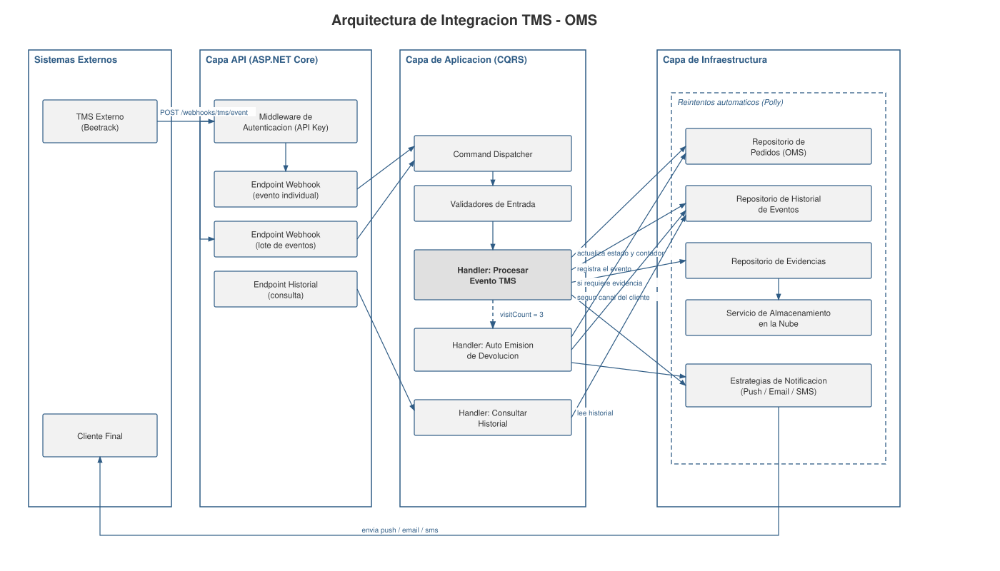

# TmsIntegration

Integración entre el TMS externo (Beetrack) y el OMS interno de la empresa de logística. Recibe los eventos de transporte vía webhook, actualiza el estado de los pedidos, almacena evidencias, notifica al cliente y deja un historial completo de todo lo que ocurre.

## Qué hace el sistema

El TMS le avisa al sistema cada vez que pasa algo con un pedido (fue asignado a una ruta, el courier llegó al punto de recojo, se entregó, no se pudo entregar, etc.). Cuando ese aviso llega:

1. Se valida que el pedido exista y que no esté ya en un estado final (entregado o devuelto).
2. Se actualiza su estado en el OMS.
3. Si el evento es `DELIVERED` o `NOT_DELIVERED`, se suma una visita al contador del pedido.
4. Si ese contador llega a 3, el sistema automáticamente marca el pedido para devolución, sin que nadie tenga que hacerlo a mano.
5. Si el evento trae fotos o firmas, se descargan y se guardan en un servicio de almacenamiento en la nube (simulado).
6. Se le avisa al cliente por su canal preferido (push, email o SMS, según el cliente).
7. Pase lo que pase, se deja registrado en un historial — incluso si el evento fue rechazado.
8. Si algo falla momentáneamente (guardar una evidencia, mandar una notificación, etc.), el sistema reintenta solo antes de darse por vencido.

Todo esto corre sobre datos en memoria, no hay conexión a bases de datos ni servicios externos reales, son mocks pensados para poder evaluar el código directamente sin configurar nada adicional.

## Diagrama de Arquitectura



El diagrama muestra el flujo completo: el TMS manda el evento, pasa por el middleware de autenticación, llega a la capa de aplicación donde se decide qué hacer con él, y de ahí se reparte hacia los pedidos, el historial, las evidencias y las notificaciones, todo esto protegido por una capa de reintentos automáticos.

### Descripción de los componentes

**Sistemas Externos**

- **TMS Externo (Beetrack):** el sistema de transporte que ya usa la empresa. Cada vez que un courier marca un evento (llegó al punto de recojo, entregó el paquete, etc.) este sistema avisa automáticamente.
- **Cliente Final:** la persona que hizo el pedido. Recibe una notificación cada vez que su pedido cambia de estado.

**Capa API**

- **Middleware de Autenticación:** revisa que cada petición venga con la API Key correcta antes de dejarla pasar.
- **Endpoint Webhook (evento individual):** puerta de entrada para cuando el TMS manda un solo evento.
- **Endpoint Webhook (lote de eventos):** puerta de entrada para cuando el TMS manda varios eventos juntos de una sola vez.
- **Endpoint Historial:** permite consultar todo lo que ha pasado con un pedido, o con todos los pedidos en general.

**Capa de Aplicación**

- **Command Dispatcher:** recibe la petición y la manda al lugar correcto para que se procese.
- **Validadores de Entrada:** revisan que la información que llegó esté completa y bien formada.
- **Handler: Procesar Evento TMS:** el corazón del sistema. Decide qué hacer con el evento que llegó: actualizar el pedido, sumar la visita, guardar evidencias y avisar al cliente.
- **Handler: Auto Emisión de Devolución:** se activa solo cuando un pedido acumula 3 intentos fallidos de entrega. Lo marca automáticamente para devolución.
- **Handler: Consultar Historial:** trae el registro completo de eventos cuando alguien lo pide.

**Capa de Infraestructura**

- **Repositorio de Pedidos (OMS):** donde vive la información de cada pedido — su estado actual, cuántas veces se ha intentado entregar, etc.
- **Repositorio de Historial de Eventos:** guarda todo lo que pasó, incluso los eventos rechazados, para poder revisar después qué ocurrió.
- **Repositorio de Evidencias:** guarda la referencia de las fotos o firmas que llegan del TMS, asociadas a su pedido.
- **Servicio de Almacenamiento en la Nube:** sube las fotos a un lugar seguro (simulado) y devuelve el link donde quedaron guardadas.
- **Estrategias de Notificación:** cada cliente recibe los avisos por su canal preferido — push, email o SMS. Este componente sabe cuál usar para cada uno.
- **Reintentos automáticos:** no es un componente como tal, sino una protección que envuelve a toda la infraestructura. Si algo falla momentáneamente, el sistema reintenta solo antes de darse por vencido.

## Estructura del proyecto

El proyecto sigue una arquitectura por capas, separando responsabilidades:

```
TmsIntegration.slnx
src/
├── TmsIntegration.Api/              -> Endpoints HTTP, middleware, documentación
├── TmsIntegration.Application/      -> Casos de uso (comandos, queries, validadores)
├── TmsIntegration.Domain/           -> Entidades, reglas de negocio, contratos
└── TmsIntegration.Infrastructure/   -> Repositorios en memoria, servicios mock, reintentos
```

Cada acción del sistema (procesar un evento, auto-emitir una devolución, consultar el historial) vive en su propio comando con su propio handler, así que cada una se puede leer y entender de forma aislada.

## Requisitos previos

- [.NET 10 SDK](https://dotnet.microsoft.com/download)
- Un editor (Visual Studio 2026 o Visual Studio Code)

## Cómo ejecutarlo

Desde la raíz del proyecto (donde está `TmsIntegration.slnx`):

```bash
dotnet restore
dotnet run --project src/TmsIntegration.Api --launch-profile https
```

La API queda disponible en:

- HTTP: `http://localhost:5226`
- HTTPS: `https://localhost:7109`

No hace falta levantar nada más (ni base de datos, ni Docker) — todo el almacenamiento es en memoria y se reinicia cada vez que se vuelve a ejecutar la aplicación.

## Cómo probarlo

### Opción 1: Scalar (documentación interactiva)

Con la aplicación corriendo, entra a:

```
https://localhost:7109/scalar/v1
```

Ahí vas a encontrar todos los endpoints documentados, con la API Key ya pre-cargada (no hace falta que la escribas) y varios ejemplos de request ya armados — incluyendo casos puntuales como la auto-emisión de devolución, el almacenamiento de evidencias y la notificación según el canal del cliente. Solo hace falta abrir un endpoint, elegir un ejemplo del selector y presionar enviar.

### Opción 2: Postman

Si prefieres Postman, en este mismo repositorio está disponible la colección `TmsIntegration.postman_collection.json`, ya armada con todos los endpoints, ejemplos y validaciones automáticas (tests) para cada caso. Solo hay que importarla y correrla.

### Autenticación

Todos los endpoints requieren el header:

```
X-Api-Key: tms-secret-key-2026
```

(Configurable en `appsettings.json` si se quiere cambiar.)

## Pedidos disponibles para probar

Cada vez que se levanta la aplicación, se cargan estos pedidos de ejemplo:

| Pedido | Estado inicial | Visitas acumuladas | Canal de notificación |
|---|---|---|---|
| 2500000006-01 | Planning | 0 | Push |
| 2500000006-02 | Started | 0 | Email |
| 2500000006-03 | Collected | 0 | SMS |
| 2500000007-01 | NotDelivered | 1 | Push |
| 2500000007-02 | NotDelivered | 2 | Email |

El pedido `2500000007-02` ya tiene 2 visitas acumuladas — un solo evento `NOT_DELIVERED` más sobre él alcanza las 3 visitas y dispara la auto-devolución, así se puede ver ese comportamiento sin tener que mandar varios eventos seguidos.

> Importante: como todo vive en memoria, si se reinicia la aplicación, estos pedidos vuelven a su estado original.

## Endpoints principales

| Método | Ruta | Para qué sirve |
|---|---|---|
| POST | `/api/webhooks/tms/event` | Recibe un evento individual del TMS |
| POST | `/api/webhooks/tms/events` | Recibe varios eventos juntos, de una sola vez |
| GET | `/api/orders/{orderNumber}/history` | Consulta el historial de un pedido específico |
| GET | `/api/orders/history` | Consulta el historial completo, de todos los pedidos |

## Notas sobre el diseño

- Las reglas de negocio (qué estados son finales, cuándo suma visita, qué eventos necesitan evidencia) están centralizadas en un solo lugar, para no tener que buscarlas repartidas por el código.
- Las notificaciones usan un patrón de estrategia: cada canal (push, email, sms) es una pieza independiente, y hay un encargado que simplemente elige cuál usar según el cliente. Agregar un canal nuevo no debería requerir tocar lo que ya existe.
- Los reintentos automáticos están implementados como una capa que envuelve a los servicios existentes, así que ni los repositorios ni los servicios de notificación o evidencias tuvieron que modificarse para soportarlos.
- El historial guarda tanto los eventos que se procesaron con éxito como los que fueron rechazados, para poder reconstruir después qué pasó realmente con un pedido.
